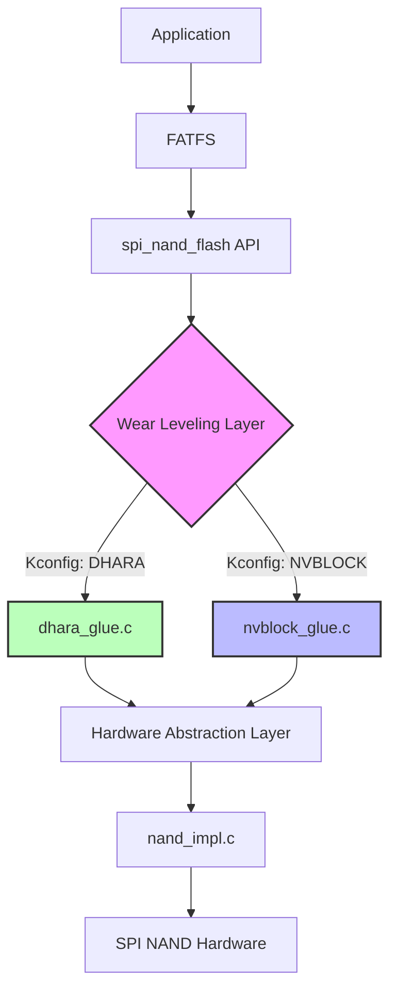
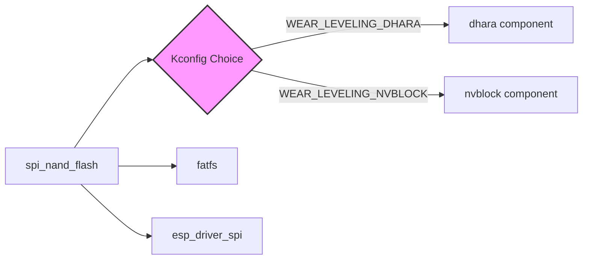

# nvblock Wear Leveling Integration Specification

**Version:** 1.0  
**Date:** 2026-03-04  
**Status:** Draft  
**Author:** OpenCode AI

---

## 1. Executive Summary

This specification describes the integration of [nvblock](https://github.com/Laczen/nvblock) as an alternative wear leveling layer for the `spi_nand_flash` ESP-IDF component. The integration will allow users to choose between **Dhara** (existing) and **nvblock** (new) wear leveling implementations at compile time via Kconfig.

### Goals
- ✅ Provide nvblock as an alternative to Dhara for wear leveling
- ✅ Maintain 100% backward compatibility with existing API
- ✅ Enable compile-time selection via Kconfig
- ✅ Reuse existing hardware abstraction layer
- ✅ Support all existing features (bad block handling, ECC, trim, sync)

### Non-Goals
- ❌ Runtime switching between wear leveling implementations
- ❌ Breaking changes to public API
- ❌ Supporting both implementations simultaneously

---

## 2. Background & Motivation

### Current State
The `spi_nand_flash` component currently uses **Dhara** library for wear leveling:
- Dhara provides FTL (Flash Translation Layer) functionality
- Integration via `dhara_glue.c` implementing `spi_nand_ops` interface
- Dhara dependency managed via `idf_component.yml`

### Why nvblock?
nvblock offers several advantages:
1. **Smaller footprint** - Configurable block sizes, minimum 64 bytes
2. **Simpler design** - Easier to understand and maintain
3. **Flexibility** - Better suited for certain use cases with smaller block sizes
4. **Active maintenance** - Modern implementation with atomic writes
5. **License compatibility** - Apache 2.0 (same as ESP-IDF)

### Use Cases
- **Resource-constrained systems** - nvblock's smaller footprint
- **Different block size requirements** - nvblock's configurable blocks
- **Atomic write guarantees** - nvblock's power-fail recovery
- **User preference** - Choice of wear leveling algorithm

---

## 3. Architecture

### 3.1 High-Level Architecture



### 3.2 Component Structure

```
spi_nand_flash/
├── src/
│   ├── dhara_glue.c           # Existing Dhara integration
│   ├── nvblock_glue.c         # NEW: nvblock integration
│   ├── nand_impl.c            # Hardware abstraction (shared)
│   └── ...
├── include/
│   └── spi_nand_flash.h       # Public API (unchanged)
├── priv_include/
│   ├── nand.h                 # Internal structures (unchanged)
│   └── nand_impl.h            # Hardware functions (unchanged)
├── idf_component.yml          # MODIFIED: Add nvblock dependency
├── Kconfig                    # MODIFIED: Add wear leveling choice
└── CMakeLists.txt             # MODIFIED: Conditional compilation
```

### 3.3 Component Dependencies



The **nvblock component** will be created separately (similar to dhara):
- Repository: `espressif/idf-extra-components/nvblock` (to be created)
- Contains nvblock library sources from upstream
- Managed as ESP-IDF component dependency

---

## 4. Interface Specifications

### 4.1 Public API (Unchanged)

The public API in `include/spi_nand_flash.h` **remains unchanged**:

```c
// All existing functions maintain same signatures
esp_err_t spi_nand_flash_init_device(spi_nand_flash_config_t *config, 
                                      spi_nand_flash_device_t **handle);
esp_err_t spi_nand_flash_read_sector(spi_nand_flash_device_t *handle, 
                                      uint8_t *buffer, uint32_t sector_id);
esp_err_t spi_nand_flash_write_sector(spi_nand_flash_device_t *handle, 
                                       const uint8_t *buffer, uint32_t sector_id);
esp_err_t spi_nand_flash_trim(spi_nand_flash_device_t *handle, uint32_t sector_id);
esp_err_t spi_nand_flash_sync(spi_nand_flash_device_t *handle);
esp_err_t spi_nand_flash_get_capacity(spi_nand_flash_device_t *handle, 
                                       uint32_t *number_of_sectors);
// ... etc (all existing functions)
```

**Guarantee:** Existing applications compile and run without any code changes.

### 4.2 Internal Interface: `spi_nand_ops`

Both `dhara_glue.c` and `nvblock_glue.c` implement the same `spi_nand_ops` structure:

```c
typedef struct {
    esp_err_t (*init)(spi_nand_flash_device_t *handle);
    esp_err_t (*deinit)(spi_nand_flash_device_t *handle);
    esp_err_t (*read)(spi_nand_flash_device_t *handle, uint8_t *buffer, 
                      uint32_t sector_id);
    esp_err_t (*write)(spi_nand_flash_device_t *handle, const uint8_t *buffer, 
                       uint32_t sector_id);
    esp_err_t (*erase_chip)(spi_nand_flash_device_t *handle);
    esp_err_t (*erase_block)(spi_nand_flash_device_t *handle, uint32_t block);
    esp_err_t (*trim)(spi_nand_flash_device_t *handle, uint32_t sector_id);
    esp_err_t (*sync)(spi_nand_flash_device_t *handle);
    esp_err_t (*copy_sector)(spi_nand_flash_device_t *handle, 
                             uint32_t src_sec, uint32_t dst_sec);
    esp_err_t (*get_capacity)(spi_nand_flash_device_t *handle, 
                              uint32_t *number_of_sectors);
} spi_nand_ops;
```

**Registration functions:**
```c
// Implemented in dhara_glue.c OR nvblock_glue.c (conditional compilation)
esp_err_t nand_register_dev(spi_nand_flash_device_t *handle);
esp_err_t nand_unregister_dev(spi_nand_flash_device_t *handle);
```

### 4.3 Hardware Abstraction Layer (Shared)

Both wear leveling implementations use the same HAL from `nand_impl.h`:

```c
// NAND flash low-level operations (shared by both Dhara and nvblock)
esp_err_t nand_is_bad(spi_nand_flash_device_t *handle, uint32_t b, 
                      bool *is_bad_status);
esp_err_t nand_mark_bad(spi_nand_flash_device_t *handle, uint32_t b);
esp_err_t nand_erase_chip(spi_nand_flash_device_t *handle);
esp_err_t nand_erase_block(spi_nand_flash_device_t *handle, uint32_t b);
esp_err_t nand_prog(spi_nand_flash_device_t *handle, uint32_t p, 
                    const uint8_t *data);
esp_err_t nand_is_free(spi_nand_flash_device_t *handle, uint32_t p, 
                       bool *is_free_status);
esp_err_t nand_read(spi_nand_flash_device_t *handle, uint32_t p, 
                    size_t offset, size_t length, uint8_t *data);
esp_err_t nand_copy(spi_nand_flash_device_t *handle, uint32_t src, 
                    uint32_t dst);
```

---

## 5. Configuration

### 5.1 Kconfig Menu Structure

```
Component config
└── SPI NAND Flash configuration
    ├── Wear Leveling Implementation (NEW)
    │   ├── ( ) Dhara (Default)
    │   └── ( ) nvblock
    ├── [ ] Verify SPI NAND flash writes
    └── [ ] Host test statistics enabled (Linux only)
```

### 5.2 Kconfig Implementation

```kconfig
menu "SPI NAND Flash configuration"

    choice NAND_FLASH_WEAR_LEVELING
        prompt "Wear Leveling Implementation"
        default NAND_FLASH_WEAR_LEVELING_DHARA
        help
            Select the wear leveling algorithm for SPI NAND Flash.
            
            - Dhara: Mature FTL implementation with radix tree mapping
            - nvblock: Lightweight implementation with configurable block sizes

        config NAND_FLASH_WEAR_LEVELING_DHARA
            bool "Dhara"
            help
                Use Dhara library for wear leveling. This is the default and
                well-tested implementation.

        config NAND_FLASH_WEAR_LEVELING_NVBLOCK
            bool "nvblock"
            help
                Use nvblock library for wear leveling. Provides smaller footprint
                and configurable block sizes. Suitable for resource-constrained
                systems.
    endchoice

    config NAND_FLASH_VERIFY_WRITE
        bool "Verify SPI NAND flash writes"
        default n
        # ... existing help text ...

    config NAND_ENABLE_STATS
        bool "Host test statistics enabled"
        depends on IDF_TARGET_LINUX
        default n
        # ... existing help text ...

endmenu
```

### 5.3 Component Dependency Management

**idf_component.yml updates:**

```yaml
version: "0.19.0"  # Bump version
description: Driver for accessing SPI NAND Flash
url: https://github.com/espressif/idf-extra-components/tree/master/spi_nand_flash
issues: https://github.com/espressif/idf-extra-components/issues
repository: https://github.com/espressif/idf-extra-components.git
documentation: https://github.com/espressif/idf-extra-components/tree/main/spi_nand_flash/README.md

dependencies:
  idf: ">=5.0"
  
  # Conditional dependency based on Kconfig
  dhara:
    version: "0.1.*"
    override_path: "../dhara"
    require: public
    rules:
      - if: "IDF_TARGET != linux"  # Existing dhara dependency
  
  # NEW: nvblock dependency
  nvblock:
    version: "0.1.*"
    override_path: "../nvblock"
    require: public
    rules:
      - if: "IDF_TARGET != linux"  # Similar to dhara
```

**Note:** The actual conditional dependency mechanism will be refined during implementation. ESP-IDF component manager may require different approach (e.g., always include both but conditionally compile).

---

## 6. Implementation Details

### 6.1 nvblock_glue.c Design

The `nvblock_glue.c` file will mirror the structure of `dhara_glue.c`:

**Private data structure:**
```c
typedef struct {
    struct nvb_info nvb_info;           // nvblock state
    struct nvb_config nvb_config;       // nvblock configuration
    spi_nand_flash_device_t *parent_handle;  // Back pointer
    uint8_t *meta_buffer;               // Metadata storage
} spi_nand_flash_nvblock_priv_data_t;
```

**Operations mapping:**

| spi_nand_ops Function | nvblock API | Notes |
|----------------------|-------------|-------|
| `init()` | `nvb_init()` | Initialize nvblock with config |
| `deinit()` | Free resources | Clean up metadata buffers |
| `read()` | `nvb_read()` | Map sector_id to nvblock block |
| `write()` | `nvb_write()` | Map sector_id to nvblock block |
| `trim()` | `nvb_write(NULL)` | nvblock uses NULL data for delete |
| `sync()` | `nvb_ioctl(NVB_CMD_CTRL_SYNC)` | Flush to hardware |
| `get_capacity()` | `nvb_ioctl(NVB_CMD_GET_BLK_COUNT)` | Query block count |
| `erase_chip()` | `nand_erase_chip()` | Pass through to HAL |
| `erase_block()` | `nand_erase_block()` | Pass through to HAL |
| `copy_sector()` | `nvb_read()` + `nvb_write()` | Emulate via read+write |

**nvblock callback implementations:**

nvblock requires callbacks for hardware operations. These will call into `nand_impl.h`:

```c
// nvblock config callbacks
static int nvb_hw_read(const struct nvb_config *cfg, uint32_t p, void *buffer);
static int nvb_hw_prog(const struct nvb_config *cfg, uint32_t p, const void *buffer);
static int nvb_hw_move(const struct nvb_config *cfg, uint32_t pf, uint32_t pt);
static bool nvb_hw_is_bad(const struct nvb_config *cfg, uint32_t p);
static bool nvb_hw_is_free(const struct nvb_config *cfg, uint32_t p);
static void nvb_hw_mark_bad(const struct nvb_config *cfg, uint32_t p);
static int nvb_hw_sync(const struct nvb_config *cfg);
```

Each callback will:
1. Extract `parent_handle` from `cfg->context`
2. Call appropriate `nand_*()` function from `nand_impl.h`
3. Convert ESP error codes to nvblock error codes

### 6.2 Sector Size and Block Size Mapping

**Key difference:** nvblock uses "blocks" while current API uses "sectors"

- **Current (Dhara):** Sector = NAND page (e.g., 2048 bytes)
- **nvblock:** Block size is configurable (min 64 bytes)

**Mapping strategy:**
- Configure nvblock block size = NAND page size
- This maintains 1:1 mapping: `sector_id` ↔ `block_id`
- Simplifies translation in read/write operations

```c
// Example in nvblock_init()
nvb_config.bsize = handle->chip.page_size;  // e.g., 2048 bytes
nvb_config.bpg = 1 << handle->chip.log2_ppb;  // blocks per group = pages per block
nvb_config.gcnt = handle->chip.num_blocks;     // total groups = total blocks
nvb_config.spgcnt = calculate_spare_groups(handle->config.gc_factor);
```

### 6.3 CMakeLists.txt Conditional Compilation

```cmake
idf_build_get_property(target IDF_TARGET)

set(reqs fatfs)
set(inc diskio include)
set(priv_inc priv_include)

# Base sources (always included)
set(srcs "src/nand.c"
         "src/nand_impl_wrap.c"
         "diskio/diskio_nand.c")

# Conditional wear leveling implementation
if(CONFIG_NAND_FLASH_WEAR_LEVELING_DHARA)
    list(APPEND srcs "src/dhara_glue.c")
elseif(CONFIG_NAND_FLASH_WEAR_LEVELING_NVBLOCK)
    list(APPEND srcs "src/nvblock_glue.c")
endif()

# ... rest of CMakeLists.txt unchanged ...
```

### 6.4 Memory Allocation

**nvblock requirements:**
- Metadata buffer for radix tree/mapping table
- Size depends on number of blocks

**Buffer allocation strategy:**
```c
// In nvblock_init()
size_t meta_size = calculate_nvblock_meta_size(
    handle->chip.num_blocks,
    nvb_config.bpg
);
uint8_t *meta_buffer = calloc(1, meta_size);
if (!meta_buffer) {
    return ESP_ERR_NO_MEM;
}
```

**Reuse existing buffers:**
- `handle->work_buffer` - Can be reused for nvblock operations
- `handle->read_buffer` - Can be reused for read staging
- `handle->temp_buffer` - Available for temporary operations

---

## 7. Testing Strategy

### 7.1 Test Coverage Requirements

| Test Category | Description | Priority |
|--------------|-------------|----------|
| **Functional** | Basic read/write/erase operations | HIGH |
| **Wear Leveling** | Verify wear distribution across blocks | HIGH |
| **Bad Block Handling** | Mark/detect/skip bad blocks | HIGH |
| **Power Loss** | Atomic write guarantees (simulated) | MEDIUM |
| **ECC** | Error correction handling | MEDIUM |
| **Trim/TRIM** | Sector deletion and space reclamation | MEDIUM |
| **Capacity** | Correct capacity reporting | LOW |
| **Performance** | Benchmark vs Dhara | LOW |

### 7.2 Test Environments

**1. Linux Host Tests (host_test/)**
- Emulated NAND flash via `nand_linux_mmap_emul.c`
- Fast iteration, no hardware required
- Power-loss simulation possible

**2. Hardware Tests (test_app/)**
- Real SPI NAND flash chips
- Verify actual hardware behavior
- Multiple chip vendors (Winbond, GigaDevice, etc.)

**3. Example Application (examples/nand_flash)**
- Real-world usage demonstration
- FATFS filesystem operations
- Kconfig option to switch implementations

### 7.3 Test Cases (High Priority)

**TC-001: Basic Read/Write with nvblock**
- Configure for nvblock via Kconfig
- Initialize device
- Write pattern to sectors 0-100
- Read back and verify
- Compare with Dhara behavior

**TC-002: Wear Leveling Verification**
- Write to same logical sector repeatedly (10000+ writes)
- Verify physical blocks are distributed
- Check max erase count difference ≤ 1

**TC-003: Bad Block Handling**
- Inject bad block during init
- Verify nvblock skips bad block
- Write across bad block boundary
- Verify data integrity

**TC-004: Trim Operation**
- Write data to sectors
- Trim specific sectors
- Verify space reclaimed (capacity check)
- Write new data to trimmed sectors

**TC-005: Full Chip Cycle**
- Write to full capacity
- Trigger garbage collection
- Verify no data loss
- Check wear leveling distribution

**TC-006: Power Loss Simulation (Linux only)**
- Start write operation
- Interrupt at random point
- Reinitialize nvblock
- Verify recovery to last valid state

### 7.4 Regression Testing

**Existing tests MUST pass with nvblock:**
- All tests in `test_app/main/test_spi_nand_flash.c` must pass
- Existing example must work unchanged
- No performance regression > 20%

---

## 8. Documentation Requirements

### 8.1 README.md Updates

**Add section: "Wear Leveling Implementation"**

```markdown
## Wear Leveling Implementation

This component supports two wear leveling implementations:

### Dhara (Default)
- Mature FTL with radix tree mapping
- Well-tested across many projects
- Default choice for most applications

### nvblock
- Lightweight implementation with smaller footprint
- Configurable block sizes (minimum 64 bytes)
- Atomic write guarantees with power-fail recovery
- Suitable for resource-constrained systems

### Selecting Implementation

Configure via menuconfig:
```
idf.py menuconfig
-> Component config
-> SPI NAND Flash configuration
-> Wear Leveling Implementation
```

Both implementations provide identical API and functionality.
```

### 8.2 Migration Guide

Create `docs/migration_dhara_to_nvblock.md`:
- When to consider nvblock
- Performance characteristics comparison
- Configuration differences
- Known limitations

### 8.3 Architecture Diagram Update

Update README.md mermaid diagram to show nvblock path alongside Dhara.

### 8.4 Code Comments

- All new functions must have Doxygen comments
- Complex nvblock mappings need inline explanations
- Error handling paths documented

---

## 9. Error Handling

### 9.1 Error Code Mapping

**nvblock → ESP-IDF error codes:**

| nvblock Error | ESP Error Code | Description |
|--------------|----------------|-------------|
| `NVB_ENOENT` | `ESP_ERR_NOT_FOUND` | Block not found |
| `NVB_EFAULT` | `ESP_FAIL` | Bad block/hardware fault |
| `NVB_EINVAL` | `ESP_ERR_INVALID_ARG` | Invalid parameter |
| `NVB_ENOSPC` | `ESP_ERR_NO_MEM` | No space available |
| `NVB_EROFS` | `ESP_ERR_INVALID_STATE` | Read-only state |
| `NVB_EAGAIN` | `ESP_ERR_INVALID_STATE` | Retry required |

### 9.2 Error Handling Strategy

**nvblock_glue.c error conversion:**
```c
static esp_err_t nvb_err_to_esp_err(int nvb_err) {
    switch (nvb_err) {
        case 0: return ESP_OK;
        case -NVB_ENOENT: return ESP_ERR_NOT_FOUND;
        case -NVB_EFAULT: return ESP_FAIL;
        case -NVB_EINVAL: return ESP_ERR_INVALID_ARG;
        case -NVB_ENOSPC: return ESP_ERR_NO_MEM;
        default: return ESP_FAIL;
    }
}
```

**Logging strategy:**
- Use `ESP_LOGE/W/I/D` macros consistently
- Log nvblock errors with context
- Include sector/block numbers in error messages

---

## 10. Performance Considerations

### 10.1 Expected Performance Characteristics

| Operation | Dhara | nvblock (Expected) | Notes |
|-----------|-------|-------------------|-------|
| Sequential Write | Baseline | ~Similar | Both use log-structured approach |
| Random Write | Baseline | ~10-20% slower | nvblock metadata overhead |
| Sequential Read | Baseline | ~Similar | Direct mapping |
| Random Read | Baseline | ~Similar | Both use translation table |
| Garbage Collection | Baseline | ~Faster | Simpler algorithm |
| Memory Usage | Baseline | ~5-10% less | Smaller metadata |

### 10.2 Optimization Opportunities

**Phase 1 (MVP):**
- Focus on correctness, not optimization
- Acceptable performance degradation: < 20%

**Phase 2 (Future):**
- Implement nvblock `comp()` callback for duplicate detection
- Optimize buffer usage (reduce allocations)
- Consider nvblock's internal copy operation if available

---

## 11. Dependencies & Prerequisites

### 11.1 External Dependencies

**nvblock ESP-IDF Component** (to be created):
- Repository: `espressif/idf-extra-components/nvblock`
- Contains nvblock library from https://github.com/Laczen/nvblock
- Version: 0.1.0 (initial)
- License: Apache 2.0

**Existing Dependencies** (unchanged):
- Dhara component (when WEAR_LEVELING_DHARA selected)
- FATFS
- ESP-IDF driver/SPI

### 11.2 Build System Requirements

- ESP-IDF >= 5.0 (existing requirement)
- Component manager support for conditional dependencies
- Kconfig choice propagation to dependencies

---

## 12. Risks & Mitigations

| Risk | Probability | Impact | Mitigation |
|------|------------|--------|------------|
| nvblock API incompatibility | Low | High | Thorough API analysis during design phase |
| Performance regression | Medium | Medium | Benchmark suite, accept < 20% degradation |
| Memory overhead | Low | Medium | Calculate buffers upfront, document requirements |
| Bad block handling differences | Medium | High | Extensive testing with simulated bad blocks |
| Component dependency issues | Medium | Low | Test with both local and remote dependencies |
| Breaking existing users | Low | Critical | Maintain backward compat, default to Dhara |

---

## 13. Success Criteria

### 13.1 Functional Requirements ✅

- [ ] nvblock compiles and links successfully
- [ ] All existing test cases pass with nvblock
- [ ] New nvblock-specific tests pass
- [ ] Both Linux and hardware targets work
- [ ] Kconfig selection works correctly
- [ ] Component dependency resolution works

### 13.2 Non-Functional Requirements ✅

- [ ] No changes to public API
- [ ] Performance degradation < 20%
- [ ] Memory overhead < 10%
- [ ] Code coverage > 80% for nvblock_glue.c
- [ ] Documentation complete and reviewed

### 13.3 Acceptance Criteria ✅

- [ ] Example application runs with nvblock
- [ ] FATFS filesystem operations work correctly
- [ ] Wear leveling distributes writes evenly
- [ ] Bad blocks handled gracefully
- [ ] Power-loss simulation passes (Linux)

---

## 14. Implementation Phases

### Phase 1: Foundation (Week 1)
- Create nvblock ESP-IDF component
- Set up basic project structure
- Implement Kconfig options
- Update CMakeLists.txt for conditional compilation

### Phase 2: Core Implementation (Week 2)
- Implement nvblock_glue.c
- Hardware callback functions
- Error handling and conversion
- Basic init/deinit/read/write

### Phase 3: Advanced Features (Week 3)
- Trim support
- Copy sector
- Sync operations
- Capacity queries

### Phase 4: Testing (Week 4)
- Linux host tests
- Hardware tests
- Bad block testing
- Wear leveling verification

### Phase 5: Documentation & Polish (Week 5)
- Update README.md
- Write migration guide
- Code review and cleanup
- Performance benchmarking

---

## 15. Open Questions

1. **nvblock configuration tuning:**
   - What should `spgcnt` (spare group count) be? Map from `gc_factor`?
   - Should we expose nvblock-specific configs in Kconfig?

2. **Component dependency mechanism:**
   - Can ESP-IDF component manager conditionally include dependencies?
   - Or should both be always present but conditionally compiled?

3. **Copy operation optimization:**
   - Does nvblock provide internal copy optimization?
   - Or emulate via read + write?

4. **Metadata buffer sizing:**
   - What is exact formula for nvblock metadata size?
   - Can we calculate at compile time or must be runtime?

5. **Backward compatibility:**
   - Should we support migration from Dhara data format to nvblock?
   - Or require chip erase when switching?

**Resolution:** These will be addressed during implementation phase with research and prototyping.

---

## 16. References

- [nvblock GitHub Repository](https://github.com/Laczen/nvblock)
- [Dhara Library](https://github.com/dlbeer/dhara)
- [ESP-IDF Component Manager](https://docs.espressif.com/projects/esp-idf/en/latest/esp32/api-guides/tools/idf-component-manager.html)
- Current `spi_nand_flash` implementation (priv_include/nand.h, src/dhara_glue.c)

---

## 17. Approval & Sign-off

**Specification Status:** Draft

**Review Checklist:**
- [ ] Architecture reviewed
- [ ] API compatibility verified
- [ ] Test strategy approved
- [ ] Performance targets agreed
- [ ] Documentation requirements clear
- [ ] Timeline realistic

**Approvers:**
- Technical Lead: _______________
- Product Owner: _______________
- QA Lead: _______________

**Date Approved:** _______________

---

*End of Specification*
